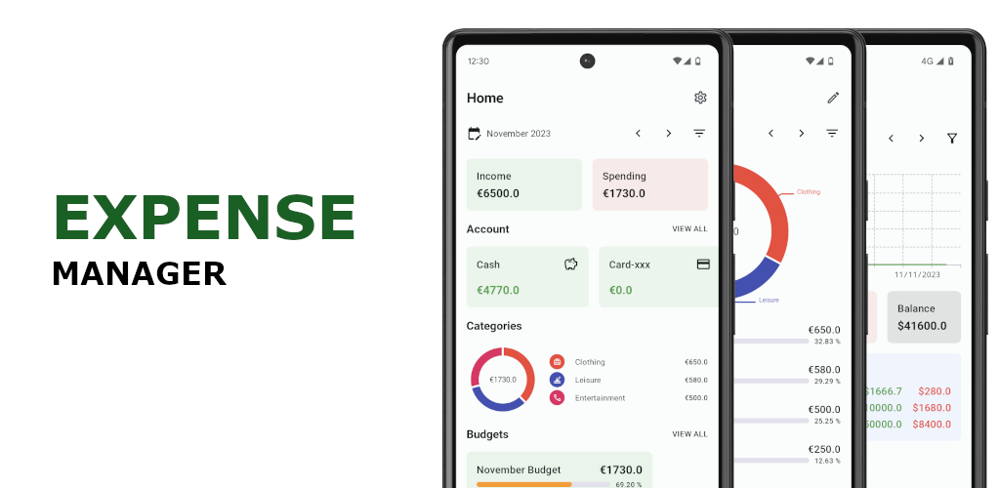
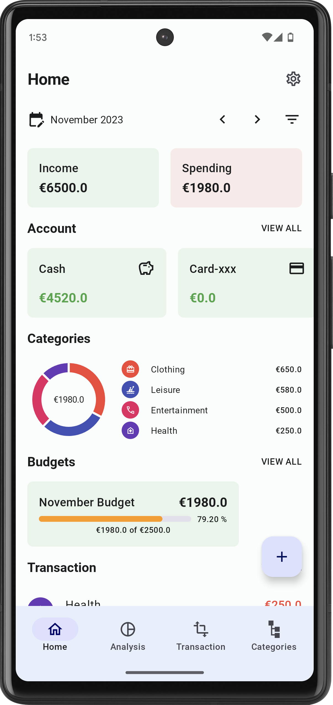
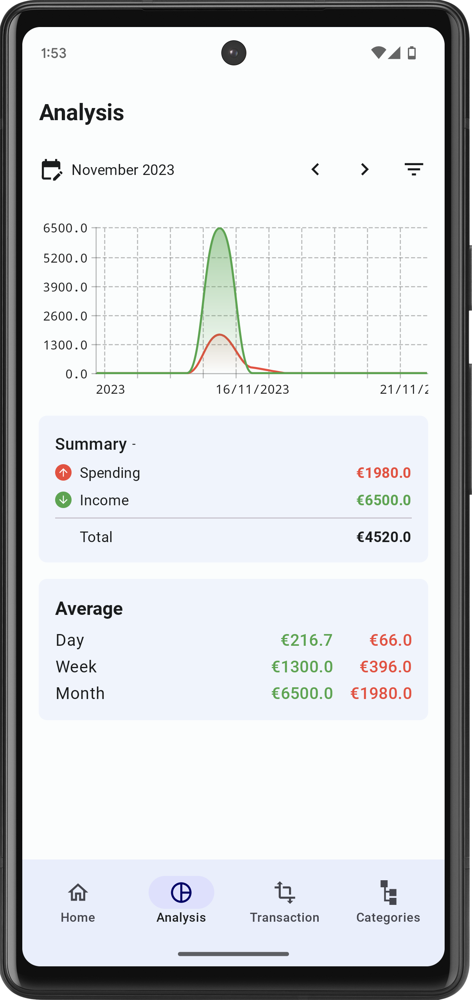
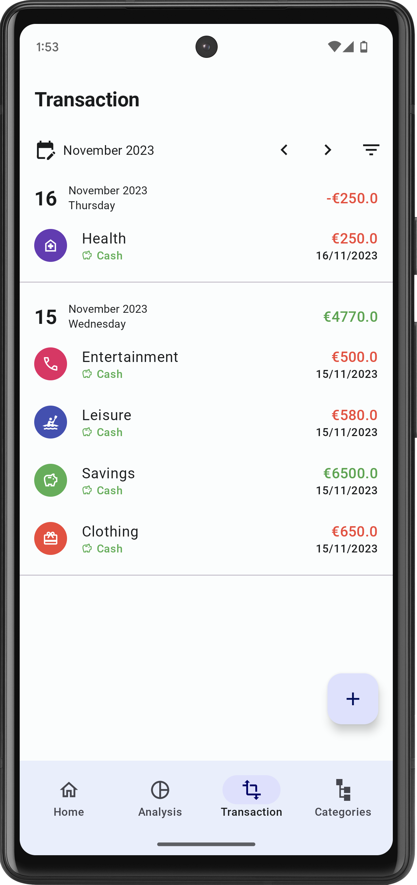
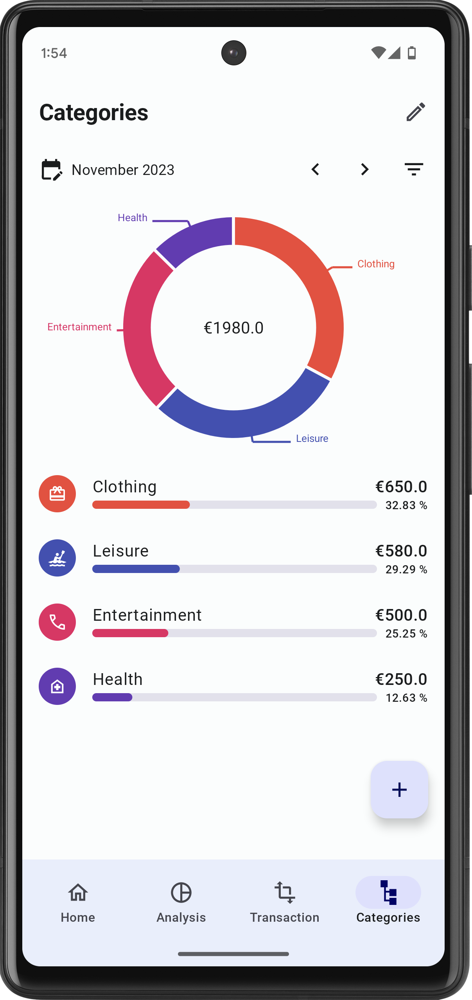
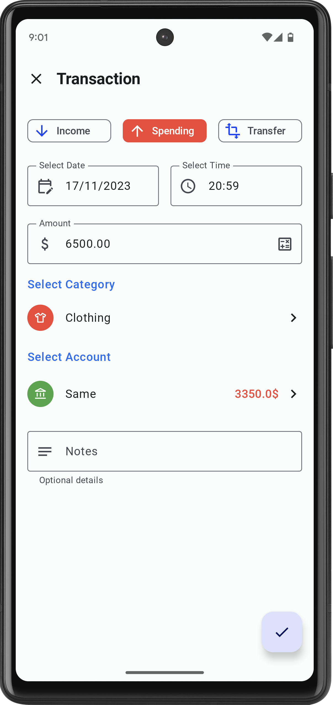
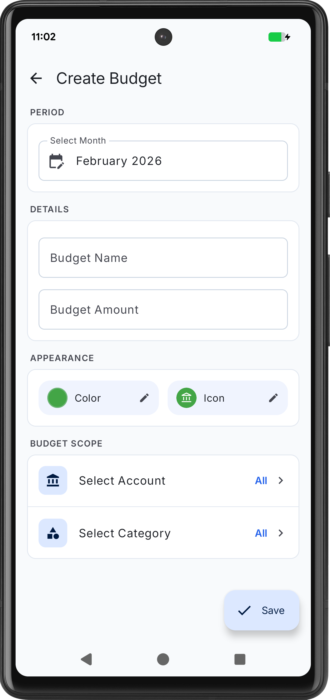
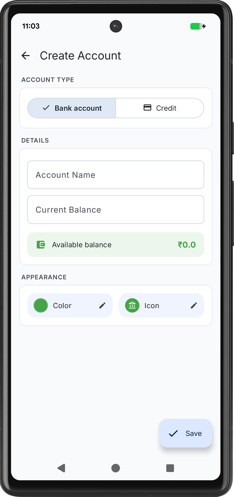
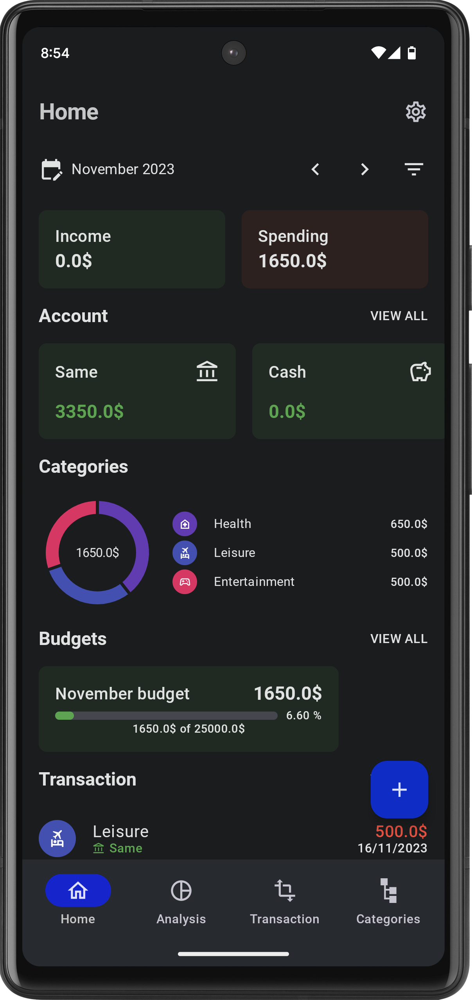

  

Expense Manager
==================

This is the repository for the [Expense Manager](https://expensemanager.naveenapps.com/) app. It is
a **work in progress** 🚧.

**Expense Manager** is a fully functional Android app built entirely with Kotlin and Jetpack
Compose. It follows Android design and development best practices and is intended to be a useful
reference for developers. As a running app, it's intended to help developers keep up-to-date with
the world of Android development by providing regular news updates.

**Features**

* Users can create multiple accounts to group their transactions under specific accounts
* Create monthly budgets and find extra budget customimizing options
* Analyse and know the trends of your transactions on a day, week and monthly wise.
* Interactive category grouping pie chart to understand where you are mostly spending your money.
* Multiple currency switching in UI (Currency conversion is yet to be supported)
* Export your transactions into csv format (pdf will be added soon)

|                    Home Screen                    |                  Analysis Screen                  |                Transaction Screen                 |               Category Chart Screen               |
|:-------------------------------------------------:|:-------------------------------------------------:|:-------------------------------------------------:|:-------------------------------------------------:|
|  |  |  |  |

|                Transaction Create                 |                  Account Create                   |                   Budget Create                   |                    Dark Theme                     |
|:-------------------------------------------------:|:-------------------------------------------------:|:-------------------------------------------------:|:-------------------------------------------------:|
|  |  |  |  | 

## Android development
Expense Manager attempts to make use of the latest Android libraries and best practices:

* Completely written in [Jetpack Compose](https://developer.android.com/jetpack/compose)
* Entirely written in [Kotlin](https://kotlinlang.org/) (
  including [Coroutines](https://kotlinlang.org/docs/reference/coroutines-overview.html)
  and [Flow](https://kotlinlang.org/docs/reference/coroutines/flow.html))
  with [Spotless](https://github.com/diffplug/spotless) for code style
* Makes use of [Android Jetpack:](https://developer.android.com/jetpack/):
    * [Architecture Components](https://developer.android.com/jetpack/arch/) including **ViewModel**, **Room**, **Navigation**, **WorkManager** and **DataStore**
    * [Android KTX](https://developer.android.com/kotlin/ktx) for more fluent use of Android APIs
* [Hilt](https://dagger.dev/hilt/) for dependency injection
* Designed and built using Material 3 Design [components](https://m3.material.io/)
  and [theming](https://m3.material.io/theme-builder)
* Full [Dark Theme](https://m3.material.io/styles/color/choosing-a-scheme) support

## Contributions

Please feel free to file an issue for errors, suggestions or feature requests. Pull requests are
also encouraged.

# License

**Expense Manager** is distributed under the terms of the Apache License (Version 2.0). See the
[license](LICENSE) for more information.
