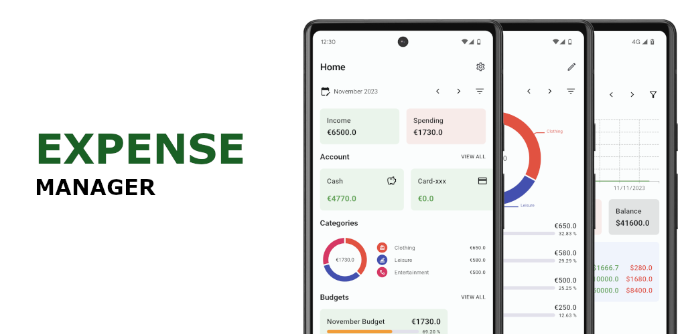
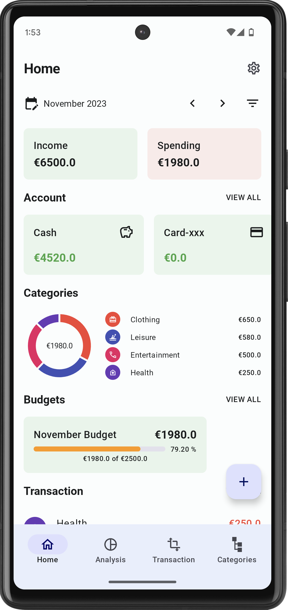
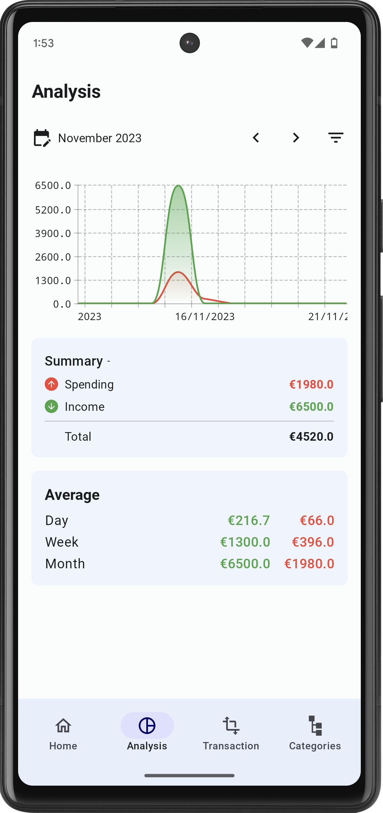
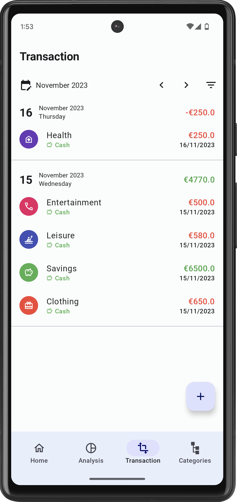
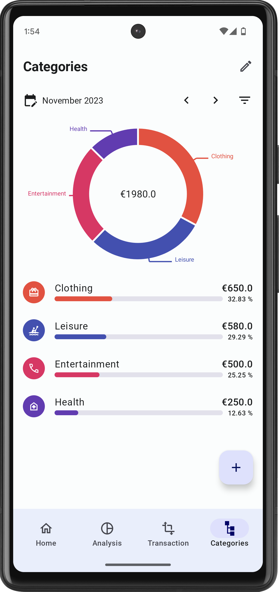
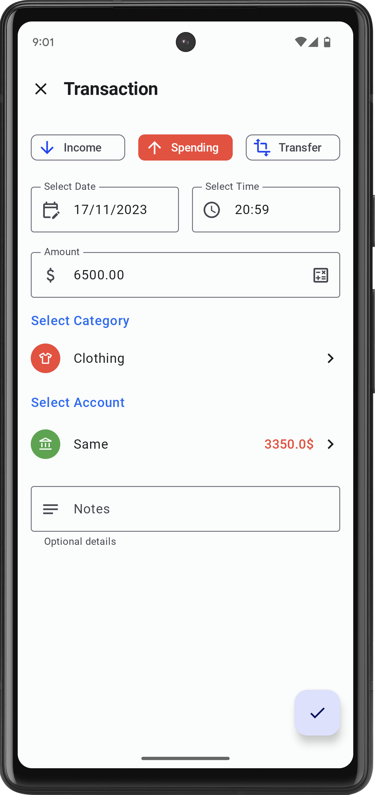
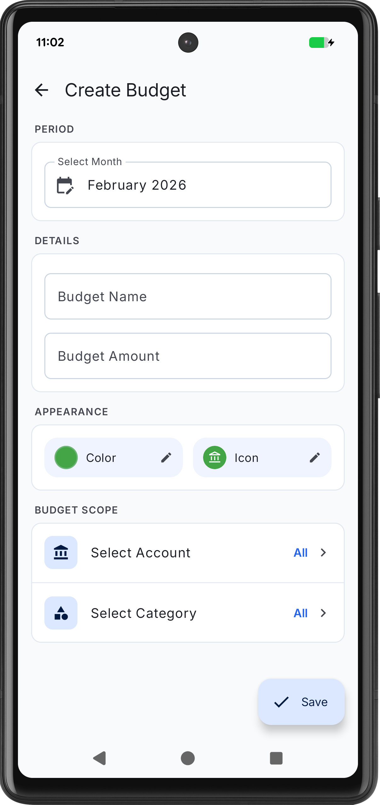
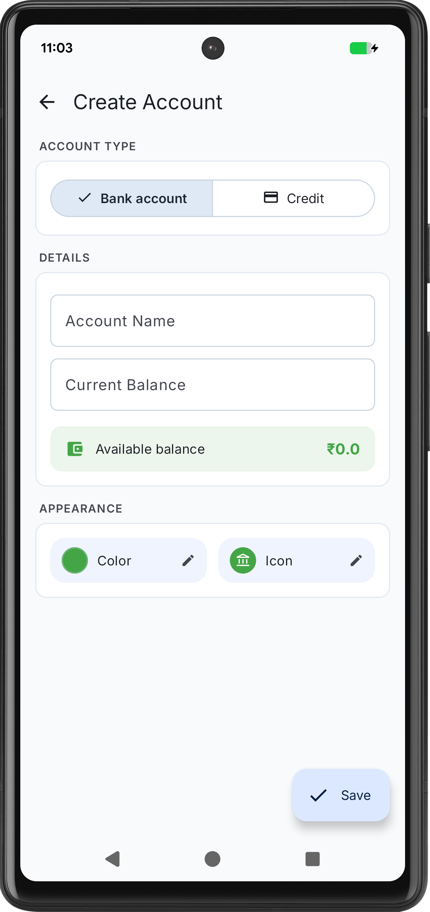
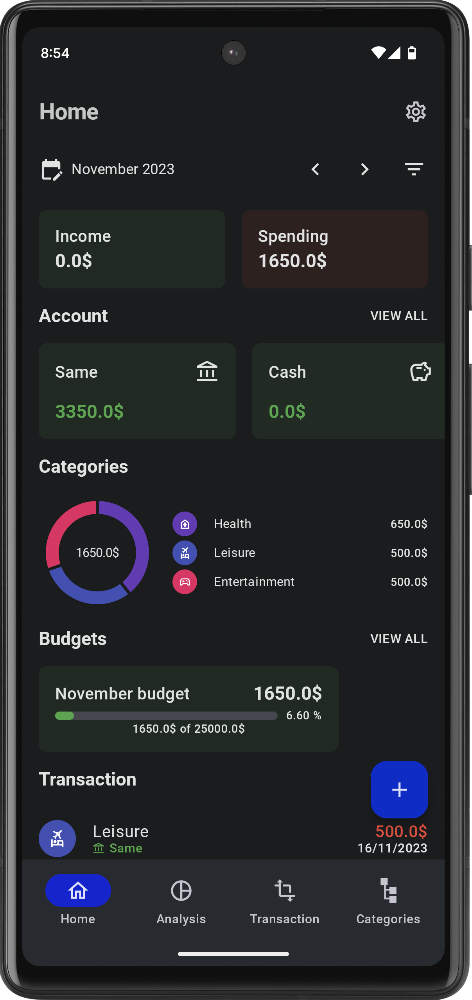

<p align="center">
  <a href="https://play.google.com/store/apps/details?id=com.naveenapps.expensemanager" target="_blank">
    
  </a>
</p>

<h1 align="center">Expense Manager</h1>

<p align="center">
  A beautifully crafted, open-source expense tracking app built entirely with Kotlin & Jetpack Compose.
</p>

<p align="center">
  <a href="https://android-arsenal.com/api?level=21"></a>
  <a href="https://github.com/nkuppan/expensemanager/actions/workflows/build.yml"></a>
  <a href="https://kotlinlang.org"></a>
  <a href="https://developer.android.com/jetpack/compose"></a>
  <a href="LICENSE"></a>
  <a href="https://github.com/sponsors/nkuppan"></a>
</p>

---

## About

**Expense Manager** is a fully functional Android app for personal finance tracking. It follows modern Android design and development best practices, making it both a useful daily-driver and a reference project for developers looking to learn production-grade Compose architecture.

> 🚧 **Work in progress** — actively maintained and accepting contributions.

---

## Screenshots

|                    Home Screen                    |                  Analysis Screen                  |                Transaction Screen                 |               Category Chart Screen               |
|:-------------------------------------------------:|:-------------------------------------------------:|:-------------------------------------------------:|:-------------------------------------------------:|
|  |  |  |  |

|                Transaction Create                 |                  Account Create                   |                   Budget Create                   |                    Dark Theme                     |
|:-------------------------------------------------:|:-------------------------------------------------:|:-------------------------------------------------:|:-------------------------------------------------:|
|  |  |  |  |

---

## Features

### Core Functionality
- **Multi-account management** — create and organise transactions across Checking, Savings, Cash, Credit Card, and custom accounts
- **Budget tracking** — set monthly budgets with flexible customisation options and track spending against your targets
- **Transaction management** — log income, expenses, and transfers between accounts with category tagging, notes, and timestamps
- **CSV export** — export your transaction data for use in spreadsheets or other tools (PDF export coming soon)
- **Multi-currency support** — switch display currencies in the UI (full conversion support is planned)

### Analytics & Insights
- **Trend analysis** — visualise your spending patterns across daily, weekly, and monthly timeframes
- **Category breakdown** — interactive pie chart showing where your money goes, grouped by category
- **Income vs. Expense summaries** — at-a-glance totals with colour-coded indicators

### Redesigned Transaction List Screen
The transaction list has been rebuilt from the ground up with a focus on usability and polish:

- **Income / Expense summary cards** — gradient-backed cards at the top showing period totals with glowing accent indicators
- **Account filter pills** — horizontally scrollable chips for quick filtering by account
- **Type filter tabs** — segmented control (All / Expense / Income) with animated selection and count badges
- **Collapsible search** — tap-to-reveal search bar with clear button for fast transaction lookup
- **Date-grouped layout** — transactions grouped by date with daily net totals in each header
- **Swipe-to-reveal actions** — gesture-driven Edit and Delete actions on each row (spring-animated, no external library)
- **Staggered entrance animations** — header, cards, and groups animate in sequentially on load
- **Empty state** — friendly messaging when filters return no results
- **Floating Action Button** — quick-access button for adding new transactions

### Improved Transaction Item Component
Each transaction row has been refined for better visual hierarchy and interaction:

- **Rounded icon container** — 44dp badge with category-tinted background and subtle border
- **Colour-coded amount prefix** — `+` for income (green), `−` for expenses (red) for instant scanning
- **Transfer arrow indicator** — clear `↓` flow between From → To accounts on transfer transactions
- **Notes preview** — single-line muted note text beneath the subtitle
- **Swipe actions** — integrated Edit / Delete reveal with spring physics animation
- **Smooth content transitions** — `animateContentSize()` for expanding/collapsing notes
- **Backward-compatible API** — all new callbacks (`onEdit`, `onDelete`, `onClick`) default to `null`, so existing call sites remain unchanged

### Theming
- Full **Material 3** design system with dynamic color support
- Complete **Dark Theme** implementation

---

## Architecture & Tech Stack

Expense Manager is structured as a multi-module project following clean architecture principles.

| Layer | Libraries / Tools |
|---|---|
| **UI** | [Jetpack Compose](https://developer.android.com/jetpack/compose), [Material 3](https://m3.material.io/) |
| **Navigation** | [Compose Navigation](https://developer.android.com/jetpack/compose/navigation) |
| **State management** | [ViewModel](https://developer.android.com/topic/libraries/architecture/viewmodel), [Kotlin Flow](https://kotlinlang.org/docs/flow.html), [Coroutines](https://kotlinlang.org/docs/coroutines-overview.html) |
| **Persistence** | [Room](https://developer.android.com/training/data-storage/room), [DataStore](https://developer.android.com/topic/libraries/architecture/datastore) |
| **Background work** | [WorkManager](https://developer.android.com/topic/libraries/architecture/workmanager) |
| **Dependency injection** | [Koin](https://insert-koin.io/) |
| **Code style** | [Spotless](https://github.com/diffplug/spotless) |
| **Language** | 100% [Kotlin](https://kotlinlang.org/) |

---

## Getting Started

### Prerequisites
- Android Studio Hedgehog (2023.1.1) or later
- JDK 17+
- Android SDK with minimum API 21

### Build & Run

```bash
# Clone the repository
git clone https://github.com/nkuppan/expensemanager.git
cd expensemanager

# Build the debug variant
./gradlew assembleDebug

# Install on a connected device
./gradlew installDebug
```

---

## Project Structure

```
expensemanager/
├── app/                    # Application module (entry point)
├── core/
│   ├── common/             # Shared utilities, colour resources, extensions
│   ├── data/               # Repository implementations, data sources
│   ├── database/           # Room database, DAOs, entities
│   ├── datastore/          # DataStore preferences
│   └── model/              # Domain models
├── feature/
│   ├── transaction/        # Transaction list, create/edit, item components
│   ├── account/            # Account management
│   ├── budget/             # Budget tracking
│   ├── analysis/           # Charts and analytics
│   └── category/           # Category management
└── docs/                   # Documentation and screenshots
```

---

## Contributing

Contributions are welcome and encouraged! Whether it's a bug fix, new feature, or documentation improvement — every PR helps.

1. **Fork** the repository
2. **Create** a feature branch (`git checkout -b feature/amazing-feature`)
3. **Commit** your changes (`git commit -m 'Add amazing feature'`)
4. **Push** to the branch (`git push origin feature/amazing-feature`)
5. **Open** a Pull Request

Please feel free to [file an issue](https://github.com/nkuppan/expensemanager/issues) for bugs, suggestions, or feature requests.

---

## Roadmap

- [x] PDF export for transaction reports
- [ ] Full multi-currency conversion with live exchange rates
- [ ] Recurring transactions (auto-generated on schedule)
- [x] Biometric app lock
- [x] Widget for home screen balance overview
- [ ] Cloud sync/backup

---

## License

**Expense Manager** is distributed under the terms of the Apache License (Version 2.0). See the [LICENSE](LICENSE) file for details.

```
Copyright 2023 Naveen Kumar Kuppan

Licensed under the Apache License, Version 2.0 (the "License");
you may not use this file except in compliance with the License.
You may obtain a copy of the License at

    http://www.apache.org/licenses/LICENSE-2.0
```
